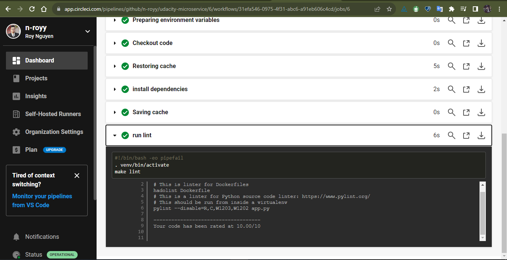

## Prerequisites

These software must be installed in your machine

1. Docker
1. K8s

## Run docker on local

1. Change dockerpath in file ./run_docker.sh base on your credentials
1. Run run_docker.sh to build and run docker file
   > ./run_docker.sh

## Push docker image to dockerhub

1. Change dockerpath in file ./upload_docker.sh
1. Export your docker hub password to system environment
   > export DOCKER_PASSWORD=<YOUR_PASSWORD>
1. run upload_docker.sh to upload to dockerhub with your tag
   > ./upload_docker.sh

## Run with k8s

1. Change dockerpath in file run_kubernetes.sh
1. Run run_kubernetes.sh
   > ./run_kubernetes.sh

## CircleCI screenshot

